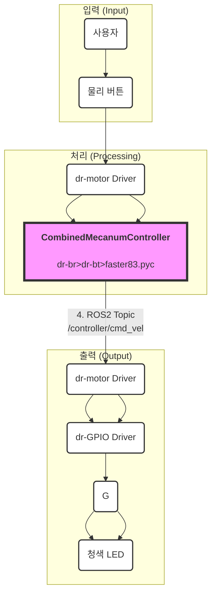
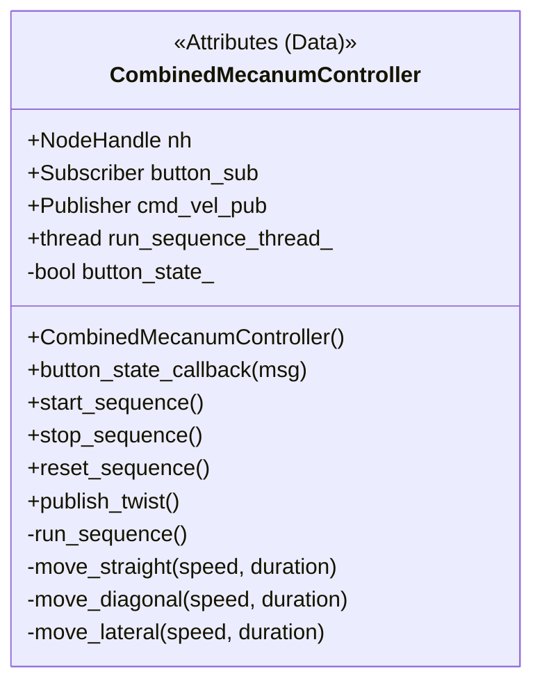

# Team Competition

> **뭐지?말고 머지?해요**

---

### Roles & Responsibilities

| Teammate | Feature |
| - | - |
| 이주용 | [키보드 입력 기반의 수동 주행 시스템 구성](https://github.com/nachalsa/rasp5/issues/6) |
| 김지현 | [자율주행 상태와 동기화된 LED 회로 구성](https://github.com/nachalsa/rasp5/issues/8) |
| 김태윤 | [키보드 입력 기반의 수동 주행 시스템 구성](https://github.com/nachalsa/rasp5/issues/6) |
| 정의한 | [키보드를 사용한 Depth Camera 조작](https://github.com/nachalsa/rasp5/issues/7) |
| 황산하 | [Wi-Fi hotspot 자동 실행](https://github.com/nachalsa/rasp5/issues/5) |

---

### Schedules

| Day | Task |
| - | - |
| 6/9(월) | 키보드 입력을 통한 조작 시스템 구현, 이미지 수집 및 라벨링, LED 회로 구성 |
| 6/10(화) | 이미지 모델 학습 및 테스트, 추가 개선, LED 회로 연결 |
| 6/12(목) | 이미지 모델 정밀 개선 및 관련 자료 문서화, 전체 기능 점검 |
| 6/13(금) | 최종 점검 및 평가 준비 |

---

### Rules

- **로봇 규정**
1. 지정된 로봇 구성품으로만 구현된 로봇으로 자율주행을 수행한다.
2. 로봇은 경연 중에 경연자 혹은 외부와 유, 무선을 이용한 모든 통신은 금지된다.

- **주행 규정**
1. 정해진 도로 폭 내에서만 주행해야 한다. **(-10점)**
2. 출발 신호는 심판이 결정하고, 신호 후 10초 이내 로봇의 자율적인 움직임이 시작돼야 한다. **(-10점)**
3. 경연자는 로봇에 부착된 스위치를 이용하여 출발 신호를 로봇에게 전달해야 한다. **(-5점)**
4. 로봇이 움직일 땐 녹색/빨간색 LED를 ON/OFF 해야 하며, 로봇이 멈춰 섰을 땐 녹색/빨간색 LED를 OFF/ON 해야 한다. **(-5점)**
5. LED Control을 Breadboard를 사용해서 Raspberry ROS ↔ Host 통신으로 구현할 경우, 가산점 부여 **(+15점)**
6. 횡단보도 앞에서, 로봇은 반드시 정지했다가 출발해야 한다. **(-10점)**
7. 도로에 적혀진 화살표를 인식한 후, 노란색 LED를 반복적으로 점멸하여 우회전할 것임을 알려야 한다. **(-10점)**
8. 교차로의 표지판을 인식하여 해당 방향으로 주행해야 한다. **(-10점)**
9. 신호등을 인식하면, 우선 멈추고 해당 신호에 맞게 주행해야 한다. **(-10점)**
10. 정지 및 주차 구간에서 정확한 라인 안에 주차가 되어야 하며, 완료의 의미로 모든 LED를 점멸해야 한다. **(-10점)**
11. 1등, 2등, 3등으로 완주했을 경우, 등수별로 차등 가산점 부여 **(+15/+10/+5점)**

---

## HLD+UML

"자율주행이 아니라 정해진 경로만 이동하는 하드코딩된 로봇"의 코드를 HLD와 UML로 설명하는 것은 "신뢰성 높고 예측 가능한 **사전 정의된 시퀀스(Pre-defined Sequence) 기반 제어**" 설계 의도를 명확하게 보여줄 수 있습니다.

### 로봇 제어 시스템 HLD (High-level Design)

### 클래스 다이어그램 (Class Diagram)

